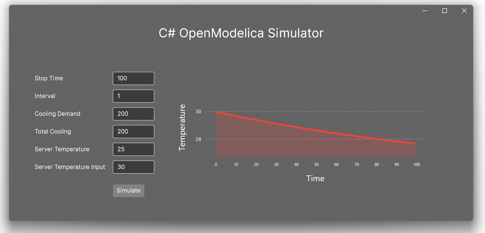

# CSharpFMUSimulator

- OpenModelica FMU C\# Simulator
- Using a Windows FMU shared library 
- based on a C\# wrapper from [rwth-irt/FmiWrapper](https://github.com/rwth-irt/FmiWrapper/tree/master)
- Build on .NET 8.0 Avalonia(cross platform) and LiveCharts2

